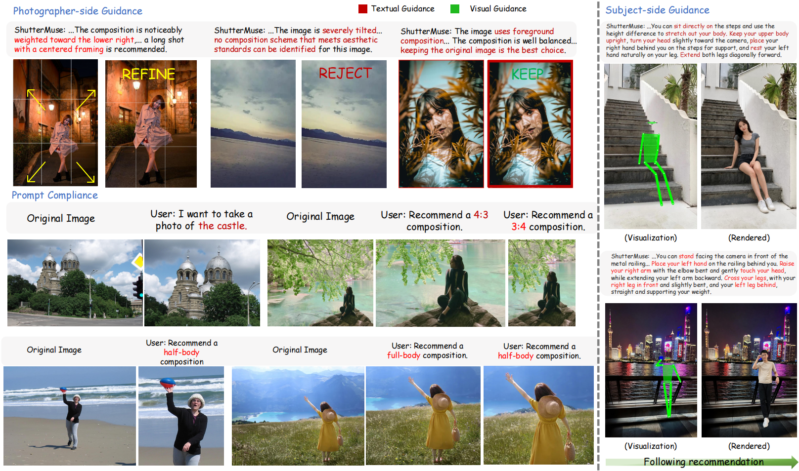
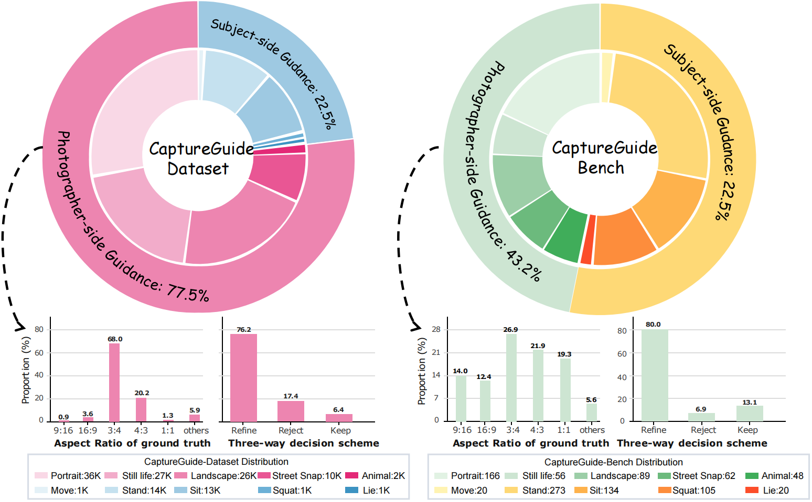

<div align="center">
  <h2>
    
    ShutterMuse: Capture-Time Photography Guidance with MLLMs
  </h2>
  <p>
    <a href="#"></a>
    <a href="https://lijayuTnT.github.io/ShutterMuse/"></a>
    <a href="#data-and-checkpoints"></a>
    
    <a href="#data-and-checkpoints"></a>
  </p>
</div>

<div align="center">
  <a href="./assets/teaser.png">
    
  </a>
</div>


**ShutterMuse** is a unified multimodal large language model for capture-time photography guidance. It supports:

- **Photographer-side guidance**: keep, refine, or reject the current framing, with a composition box when refinement is needed.
- **Subject-side guidance**: recommend scene-conditioned portrait poses with COCO-17 keypoints and visibility states.

## News

- **2026-06**: Code, quick start scripts, evaluation scripts, and examples are released.
- **TBD**: Full benchmark, dataset, checkpoints, and model cards will be linked here.

## CaptureGuide Dataset and Bench

CaptureGuide contains two task sides: photographer-side composition guidance and subject-side pose guidance. CaptureGuide-Dataset is used for model development, while CaptureGuide-Bench evaluates composition decision/refinement and pose recommendation quality.

<div align="center">
  <a href="./assets/data_distribution_01.png">
    
  </a>
</div>

<p align="center"><em>Distribution of CaptureGuide-Dataset and CaptureGuide-Bench.</em></p>

## Results

### Photographer-side Guidance


| Method          | IoU ↑     | BDE ↓     | R ↑       | RSR ↑     | KSR ↑ | MLLM-Score ↑ |
| --------------- | --------- | --------- | --------- | --------- | ----- | ------------ |
| Gemini-3.0-Pro  | 63.62     | 0.070     | 47.48     | 82.76     | 89.09 | 0.54         |
| GPT-5.5         | 65.44     | 0.091     | 41.84     | 10.34     | 81.82 | 0.48         |
| Venus           | 69.43     | 0.076     | 57.27     | 0.00      | 3.64  | 0.57         |
| **ShutterMuse** | **74.30** | **0.054** | **70.03** | **82.76** | 74.55 | **0.64**     |


### Subject-side Guidance


| Method          | Plausibility ↑ | Interaction ↑ | Aesthetics ↑ | Mean ↑ | Time ↓   | Tokens ↓ |
| --------------- | -------------- | ------------- | ------------ | ------ | -------- | -------- |
| Nano-Banana-Pro | 0.63           | 0.35          | 0.17         | 0.39   | 55.16    | 1370     |
| GPT-Image-2     | 0.59           | 0.29          | 0.15         | 0.35   | 102.61   | 1427     |
| **ShutterMuse** | 0.58           | 0.27          | 0.14         | 0.34   | **4.96** | **412**  |


## Installation

```bash
git clone https://github.com/lijayuTnT/ShutterMuse.git
cd ShutterMuse
conda create -n shuttermuse python=3.10 -y
conda activate shuttermuse
pip install -r requirements.txt
```

Model checkpoints are not stored in this repository. Please prepare the base or merged Qwen-VL checkpoint and the ShutterMuse LoRA/checkpoint separately.

## Quick Start

Set checkpoint paths:

```bash
export MODEL_PATH=/path/to/base-or-merged-qwen-vl-checkpoint
export LORA_PATH=/path/to/shuttermuse-lora  # leave empty for a fully merged checkpoint
export OUTPUT_DIR=outputs/quick_start
```

Photographer-side composition guidance:

```bash
bash evaluation/scripts/quick_start.sh \
  --side photographer \
  --image test/401128801616615964.webp \
  --model-path "$MODEL_PATH" \
  --lora-path "$LORA_PATH" \
  --output-dir "$OUTPUT_DIR"
```

Subject-side pose guidance:

```bash
bash evaluation/scripts/quick_start.sh \
  --side subject \
  --image /path/to/scene.jpg \
  --model-path "$MODEL_PATH" \
  --lora-path "$LORA_PATH" \
  --output-dir "$OUTPUT_DIR"
```

Outputs include a JSON prediction and a `.webp` visualization. Run `bash evaluation/scripts/quick_start.sh --help` for all options.

## Training

ShutterMuse training follows two stages. The released scripts are lightweight launch templates; set local model, data, and GPU paths before running.

Stage 1: supervised fine-tuning (SFT) with ModelScope Swift:

```bash
export MODEL_PATH=/path/to/Qwen3-VL-8B-Instruct
export SFT_DATASET=/path/to/sft_train.jsonl
export OUTPUT_ROOT=outputs/training/stage1_sft
bash training/stage1_sft.sh
```

Stage 2: GRPO fine-tuning from the stage-1 checkpoint:

```bash
export MODEL_PATH=/path/to/stage1-merged-or-base-checkpoint
export GRPO_DATASET_PATH=/path/to/grpo_dataset.jsonl
export OUTPUT_ROOT=outputs/training/stage2_grpo
bash training/stage2_grpo.sh
```

Optional saliency rewards can use a precomputed BiRefNet file:

```bash
python training/grpo_utils/precompute_birefnet_saliency.py \
  --dataset "$GRPO_DATASET_PATH" \
  --output /path/to/grpo_dataset_birefnet_saliency.jsonl
export SALIENCY_PRECOMPUTE_JSONL=/path/to/grpo_dataset_birefnet_saliency.jsonl
```

The GRPO script registers datasets with `training/grpo_utils/data_format.py` and rewards with `training/grpo_utils/reward_func.py` (`ratio_orm`, `iou_orm`, `pose_visibility_orm`, `saliency_orm`). Common overrides include `CUDA_VISIBLE_DEVICES`, `NPROC_PER_NODE`, `PER_DEVICE_TRAIN_BATCH_SIZE`, `LEARNING_RATE`, `OUTPUT_DIR`, and `VLLM_SERVER_PORT`.

## Evaluation

Unified entry:

```bash
bash evaluation/scripts/run_unified_evaluation.sh photographer-model
bash evaluation/scripts/run_unified_evaluation.sh photographer-baseline
bash evaluation/scripts/run_unified_evaluation.sh subject
bash evaluation/scripts/run_unified_evaluation.sh subject-baseline
```

Common configuration:

```bash
export OUTPUT_ROOT=outputs/evaluation
export PHOTOGRAPHER_MODEL_PATH=/path/to/base-or-merged-qwen-vl-checkpoint
export PHOTOGRAPHER_LORA_TEMPLATE=/path/to/lora/checkpoint-{step}
export PHOTOGRAPHER_STEPS="6000"
export SUBJECT_MODEL_PATH=/path/to/base-or-merged-qwen-vl-checkpoint
export SUBJECT_LORA_TEMPLATE=/path/to/lora/checkpoint-{step}
export SUBJECT_STEPS="6000"
```

For VLM scoring or API baselines, set keys through environment variables:

```bash
export GEMINI_API_KEY="your_api_key"
export QWEN_API_KEY="your_api_key"
export GPT_API_KEY="your_api_key"
```

## Repository Structure

```text
ShutterMuse/
├── assets/          # README figures
├── evaluation/      # Inference and benchmark scripts
├── training/        # Two-stage SFT and GRPO training scripts
├── test/            # Small example images
├── README.md
└── requirements.txt
```

`Benchmark/` and `outputs/` are intentionally excluded from git. The full benchmark will be released separately.

## Data and Checkpoints


| Resource               | Status      | Link |
| ---------------------- | ----------- | ---- |
| CaptureGuide-Bench     | Coming soon | TODO |
| CaptureGuide-Dataset   | Coming soon | TODO |
| ShutterMuse checkpoint | Coming soon | TODO |


## Citation

```bibtex
@misc{li2026shuttermuse,
  title        = {ShutterMuse: Capture-Time Photography Guidance with MLLMs},
  author       = {Li, Jiayu and Fang, Yixiao and Hu, Tianyu and Cheng, Wei and Huang, Ping and Fan, Zheheng and Yu, Gang and Ma, Xingjun},
  year         = {2026},
  note         = {Preprint}
}
```

## License

TODO: Add license information before public release.
