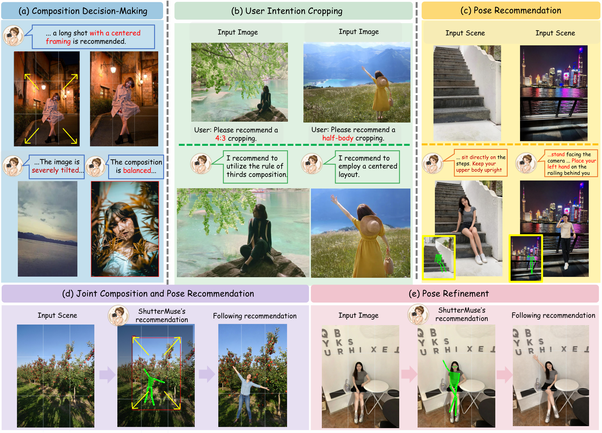
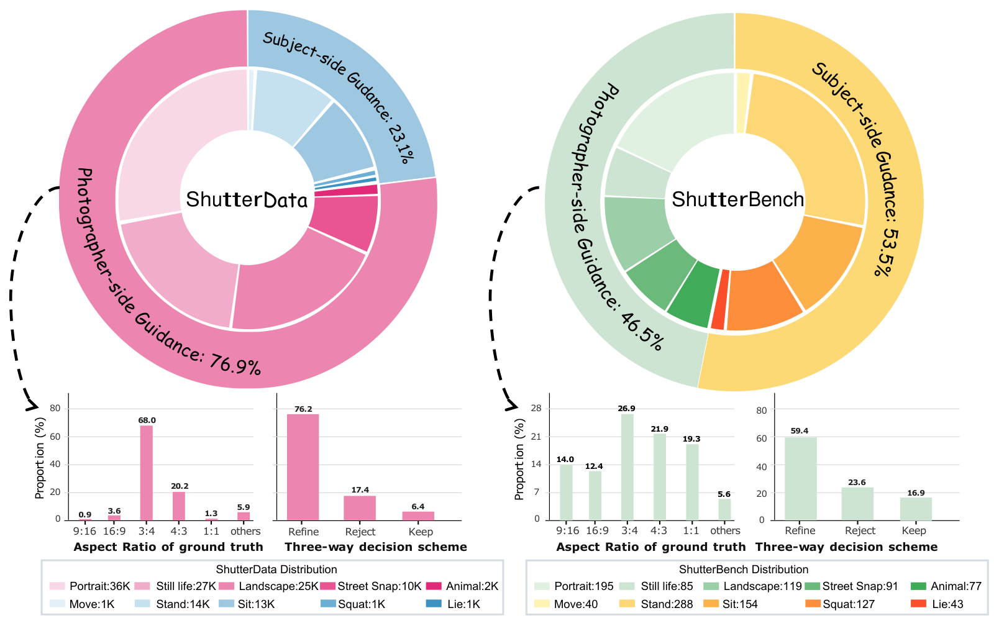

<div align="center">
  <h2>
    
    ShutterMuse: Capture-Time Photography Guidance with MLLMs
  </h2>
  <p>
    <a href="https://arxiv.org/abs/2606.25763"></a>
    <a href="https://lijayuTnT.github.io/ShutterMuse/"></a>
    <a href="https://huggingface.co/ShutterMuse/ShutterMuse"></a>
    <a href="https://huggingface.co/datasets/ShutterMuse/CaptureGuide-Bench"></a>
  </p>
</div>

<div align="center">
  <a href="./assets/teaser.png">
    
  </a>
</div>


**ShutterMuse** is a unified multimodal large language model for capture-time photography guidance. It supports:

- **Photographer-side guidance**: keep, refine, or reject the current framing, with a composition box when refinement is needed.
- **Subject-side guidance**: recommend scene-conditioned portrait poses with COCO-17 keypoints and visibility states.

## News

- **2026-09**: ShutterData, ShutterBench, experimental results, and the GRPO training recipe are updated.
- **2026-06**: Code, quick start scripts, evaluation scripts, examples, benchmark data, and ShutterMuse model weights are released.

## ShutterData and ShutterBench

**ShutterData** contains 130K atomic training examples—100K for photographer-side composition guidance and 30K for subject-side pose guidance—plus 5K joint composition-and-pose examples and 5K pose-refinement examples. **ShutterBench** evaluates both sides: its photographer-side split contains 567 examples (337 refine, 96 keep, and 134 reject), while its subject-side split contains 552 reserved scenes and 100 real-world empty scenes.

<div align="center">
  <a href="./assets/data_distribution_01.png">
    
  </a>
</div>

<p align="center"><em>Distribution of ShutterData and ShutterBench.</em></p>

## Results

### Photographer-side Guidance

| Method | IoU (%) ↑ | BDE ↓ | R@0.7 (%) ↑ | RSR (%) ↑ | KSR (%) ↑ | Macro-F1 (%) ↑ | MLLM-Score ↑ |
| --- | ---: | ---: | ---: | ---: | ---: | ---: | ---: |
| **Open-source General MLLMs** |  |  |  |  |  |  |  |
| InternVL3.5-8B | 42.86 | 0.127 | 8.61 | 0.00 | 22.92 | 29.09 | 0.18 |
| Kimi-K2.6 | 65.60 | 0.092 | 38.28 | 4.48 | 96.88 | 28.79 | 0.47 |
| Qwen3-VL-8B-Instruct | 54.44 | 0.107 | 16.91 | 2.24 | 40.62 | 29.27 | 0.35 |
| Qwen3-VL-32B-Instruct | 64.33 | 0.099 | 37.39 | 7.46 | 96.88 | 20.14 | 0.43 |
| Qwen3-VL-235B-A22B-Instruct | 63.97 | 0.094 | 35.61 | 10.45 | **100.00** | 25.77 | 0.48 |
| Qwen3.5-9B | 61.94 | 0.094 | 30.86 | 5.97 | 77.08 | 31.37 | 0.46 |
| Qwen3.6-27B | 53.96 | 0.084 | 31.45 | 50.00 | 66.67 | 45.24 | 0.48 |
| **Proprietary General MLLMs** |  |  |  |  |  |  |  |
| Gemini-3.0-Flash | 62.46 | 0.077 | 36.80 | **74.63** | 70.83 | 68.99 | 0.60 |
| Gemini-3.0-Pro | 64.08 | 0.070 | 47.77 | 72.39 | 81.25 | 63.39 | 0.63 |
| Gemini-3.1-Pro | 65.42 | 0.069 | 49.85 | 72.39 | 80.21 | 64.31 | 0.65 |
| Gemini-3.5-Flash | 66.05 | 0.075 | 46.29 | 57.46 | 86.46 | 57.39 | 0.63 |
| GPT-5.4 | 60.03 | 0.089 | 35.91 | 46.27 | 67.71 | 48.89 | 0.48 |
| GPT-5.5 | 69.74 | 0.078 | 55.49 | 5.22 | 45.83 | 33.75 | 0.48 |
| **Specialized Aesthetic Cropping Models** |  |  |  |  |  |  |  |
| CACNet | 67.57 | 0.080 | 51.93 | 0.00 | 0.00 | 24.85 | 0.37 |
| UNIC | 64.35 | 0.081 | 36.20 | 0.00 | 0.00 | 24.85 | 0.29 |
| InstructCrop | 69.53 | 0.072 | 56.97 | 0.00 | 0.00 | 24.85 | 0.36 |
| Venus | 69.90 | 0.075 | 59.05 | 0.00 | 2.08 | 26.24 | 0.44 |
| **ShutterMuse (Ours)** | **74.72** | **0.053** | **68.25** | 68.66 | 79.17 | **70.10** | **0.69** |

### FLMS Benchmark

| Method | IoU (%) ↑ | BDE ↓ |
| --- | ---: | ---: |
| Gemini-3.0-Pro | 77.13 | 0.049 |
| Gemini-3.5-Flash | 77.69 | 0.048 |
| GPT-5.5 | 64.99 | 0.049 |
| InstructCrop | 80.98 | 0.043 |
| CACNet | 84.04 | 0.037 |
| Venus | <u>86.63</u> | <u>0.030</u> |
| **ShutterMuse (Ours)** | **87.61** | **0.027** |

### Subject-side Guidance


| Method | Plausibility ↑ | Interaction ↑ | Aesthetics ↑ | Mean ↑ | Time (s) ↓ | # Tokens ↓ |
| --- | ---: | ---: | ---: | ---: | ---: | ---: |
| **Image Generation Models** |  |  |  |  |  |  |
| Nano-Banana-Pro | **0.87** | **0.48** | **0.45** | **0.60** | 55.16 | 1370 |
| GPT-Image-2 | 0.81 | 0.40 | 0.38 | 0.53 | 102.61 | 1427 |
| **Vision-Language Models** |  |  |  |  |  |  |
| Qwen3-VL-8B-Instruct | 0.26 | 0.17 | 0.06 | 0.16 | 5.17 | 284.60 |
| Qwen3-VL-235B-A22B-Instruct | 0.66 | 0.12 | 0.05 | 0.28 | 11.37 | 366.56 |
| Kimi-K2.6 | 0.81 | 0.12 | 0.08 | 0.34 | 5.99 | **249.47** |
| Gemini-3.1-Pro | 0.78 | 0.22 | 0.29 | 0.43 | 20.85 | 439.46 |
| GPT-5.5 | 0.54 | 0.21 | 0.25 | 0.33 | 19.15 | 1052 |
| **ShutterMuse (Ours)** | 0.80 | 0.33 | 0.36 | 0.50 | **4.96** | 412 |


## Installation

```bash
git clone https://github.com/lijayuTnT/ShutterMuse.git
cd ShutterMuse
conda create -n shuttermuse python=3.10 -y
conda activate shuttermuse
pip install -r requirements.txt
```

ShutterMuse model weights are released on [Hugging Face](https://huggingface.co/ShutterMuse/ShutterMuse). Please prepare the base or merged Qwen-VL checkpoint and the ShutterMuse LoRA/checkpoint according to the model card.

## Quick Start

Set checkpoint paths:

```bash
export MODEL_PATH=/path/to/base-or-merged-qwen-vl-checkpoint
export LORA_PATH=/path/to/shuttermuse-lora  # leave empty for a fully merged checkpoint
export OUTPUT_DIR=outputs/quick_start
```

Photographer-side composition guidance:

```bash
bash evaluation/scripts/quick_start.sh \
  --side photographer \
  --image test/401128801616615964.webp \
  --model-path "$MODEL_PATH" \
  --lora-path "$LORA_PATH" \
  --output-dir "$OUTPUT_DIR"
```

Subject-side pose guidance:

```bash
bash evaluation/scripts/quick_start.sh \
  --side subject \
  --image /path/to/scene.jpg \
  --model-path "$MODEL_PATH" \
  --lora-path "$LORA_PATH" \
  --output-dir "$OUTPUT_DIR"
```

Outputs include a JSON prediction and a `.webp` visualization. Run `bash evaluation/scripts/quick_start.sh --help` for all options.

## Training

ShutterMuse training follows two stages. The released scripts are lightweight launch templates; set local model, data, and GPU paths before running.

Stage 1: supervised fine-tuning (SFT) with ModelScope Swift:

```bash
export MODEL_PATH=/path/to/Qwen3-VL-8B-Instruct
export SFT_DATASET=/path/to/sft_train.jsonl
export OUTPUT_ROOT=outputs/training/stage1_sft
bash training/stage1_sft.sh
```

Stage 2: GRPO fine-tuning from the stage-1 checkpoint:

```bash
export MODEL_PATH=/path/to/stage1-merged-or-base-checkpoint
export GRPO_DATASET_PATH=/path/to/grpo_dataset.jsonl
export OUTPUT_ROOT=outputs/training/stage2_grpo
bash training/stage2_grpo.sh
```

Optional saliency rewards can use a precomputed BiRefNet file:

```bash
python training/grpo_utils/precompute_birefnet_saliency.py \
  --dataset "$GRPO_DATASET_PATH" \
  --output /path/to/grpo_dataset_birefnet_saliency.jsonl
export SALIENCY_PRECOMPUTE_JSONL=/path/to/grpo_dataset_birefnet_saliency.jsonl
```

The GRPO script registers datasets with `training/grpo_utils/data_format.py` and rewards with `training/grpo_utils/reward_func.py`. By default, it uses the decision reward `decision_making_orm` and the localization-and-saliency reward `saliency_iou_orm` with equal weights. Legacy rewards (`ratio_orm`, `iou_orm`, `pose_visibility_orm`, and `saliency_orm`) remain available through `REWARD_FUNCS`. Common overrides include `CUDA_VISIBLE_DEVICES`, `NPROC_PER_NODE`, `PER_DEVICE_TRAIN_BATCH_SIZE`, `LEARNING_RATE`, `OUTPUT_DIR`, and `VLLM_SERVER_PORT`.

## Evaluation

Unified entry:

```bash
bash evaluation/scripts/run_unified_evaluation.sh photographer-model
bash evaluation/scripts/run_unified_evaluation.sh photographer-baseline
bash evaluation/scripts/run_unified_evaluation.sh subject
bash evaluation/scripts/run_unified_evaluation.sh subject-baseline
```

Common configuration:

```bash
export OUTPUT_ROOT=outputs/evaluation
export PHOTOGRAPHER_MODEL_PATH=/path/to/base-or-merged-qwen-vl-checkpoint
export PHOTOGRAPHER_LORA_TEMPLATE=/path/to/lora/checkpoint-{step}
export PHOTOGRAPHER_STEPS="6000"
export SUBJECT_MODEL_PATH=/path/to/base-or-merged-qwen-vl-checkpoint
export SUBJECT_LORA_TEMPLATE=/path/to/lora/checkpoint-{step}
export SUBJECT_STEPS="6000"
```

For VLM scoring or API baselines, set keys through environment variables:

```bash
export GEMINI_API_KEY="your_api_key"
export QWEN_API_KEY="your_api_key"
export GPT_API_KEY="your_api_key"
```

## Repository Structure

```text
ShutterMuse/
├── assets/          # README figures
├── evaluation/      # Inference and benchmark scripts
├── training/        # Two-stage SFT and GRPO training scripts
├── test/            # Small example images
├── README.md
└── requirements.txt
```

`Benchmark/` and `outputs/` are intentionally excluded from git. ShutterBench is available on [Hugging Face](https://huggingface.co/datasets/ShutterMuse/CaptureGuide-Bench).

## Data and Checkpoints


| Resource               | Status      | Link |
| ---------------------- | ----------- | ---- |
| ShutterBench           | Released    | [Hugging Face](https://huggingface.co/datasets/ShutterMuse/CaptureGuide-Bench) |
| ShutterMuse checkpoint | Released    | [Hugging Face](https://huggingface.co/ShutterMuse/ShutterMuse) |


## Citation

```bibtex
@misc{li2026shuttermuse,
  title        = {ShutterMuse: Capture-Time Photography Guidance with MLLMs},
  author       = {Li, Jiayu and Fang, Yixiao and Hu, Tianyu and Cheng, Wei and Huang, Ping and Fan, Zheheng and Yu, Gang and Ma, Xingjun},
  year         = {2026},
  note         = {Preprint}
}
```

## License

TODO: Add license information before public release.
